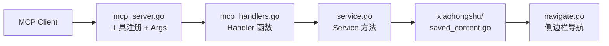

# Plan: 收藏内容与收藏夹浏览功能

## Goal

新增 3 个 MCP 工具，让用户可以浏览自己的收藏内容：
1. `list_collections` — 列出所有收藏夹
2. `get_collection_content` — 读取特定收藏夹中的笔记
3. `list_saved_content` — 读取全部收藏内容（不分收藏夹）

## Architecture Overview



## Implementation Phases

实现分两阶段，先验证后抽象：

### Phase 1: 探测 + 基本功能（先落地）
1. 实现 `list_collections`，内置 state 探测日志
2. 根据运行时探测结果确认 state root / key / 数据格式
3. 实现 `list_saved_content` 和 `get_collection_content`，收藏内容翻页先用独立的滚动逻辑

### Phase 2: 抽象优化（验证后再做）
4. 若收藏页翻页机制与搜索一致，再提取 `scrollAndCollectFeedsWithReader` 共享函数
5. 若不一致，保持独立实现

## Changes

### 1. `xiaohongshu/saved_content.go`: 新文件 — 收藏浏览核心逻辑

**What**: `SavedContentAction` 结构体，包含 3 个方法 + 辅助函数。
**Why**: 与其他 Action（SearchAction, FeedsListAction 等）保持一致的代码组织。

#### 结构体

```go
type SavedContentAction struct {
    page *rod.Page
}

func NewSavedContentAction(page *rod.Page) *SavedContentAction
```

#### 方法 1: `ListCollections`

```go
func (s *SavedContentAction) ListCollections(ctx context.Context) ([]Collection, error)
```

流程：
1. **安全导航**到个人主页（使用 `safeNavigateToProfile`，非 Must API）
2. 获取当前页面完整 URL（保留所有 query 参数）
3. 在当前 URL 基础上追加 `?tab=collect`（而非重新拼 URL）
4. 等待 `__INITIAL_STATE__` 加载
5. **两层探测**：先 `Object.keys(__INITIAL_STATE__)` 确认 root slice，再探测候选 key
6. 读取收藏夹列表数据
7. 如果 URL 导航失败，fallback 为点击页面上的收藏 tab 元素

**错误处理**：
- 未登录 → `safeNavigateToProfile` 返回 `ErrNotLoggedIn` → handler 返回 `"请先登录小红书"`
- 无收藏夹 → state key 存在但值为空数组 → 返回空 `[]Collection`

#### 方法 2: `GetCollectionContent`

```go
func (s *SavedContentAction) GetCollectionContent(ctx context.Context, collectionID string, limit int) ([]Feed, error)
```

流程：
1. **安全导航**到个人主页
2. 获取当前 profile URL（保留 query 参数）
3. 在 profile URL 基础上构造收藏夹 URL：`{profileURL}/collect/{collectionID}`
4. 导航到收藏夹页面
5. 等待 `__INITIAL_STATE__` 加载
6. 两层探测读取收藏内容
7. **数据归一化**：通过 `flattenFeeds` 统一处理 `[]Feed` / `[][]Feed`
8. 如需翻页，使用独立的滚动加载逻辑（Phase 1 不复用搜索翻页）

**错误处理**：
- 未登录 → 同上
- 无效 collection_id → 页面出现错误提示容器（复用 `checkPageAccessible` 检测模式）或 state 中找不到对应数据 → 返回 `"收藏夹不存在或无法访问"`
- 收藏夹为空 → state key 存在但内容为空 → 返回空 `[]Feed`

**URL 导航失败时**：如果 `{profileURL}/collect/{collectionID}` 不可用（`checkPageAccessible` 检测到错误），直接返回错误。DOM 点击 fallback 作为**运行时验证项**——在 Phase 1 验证阶段确认 URL 路由是否可用后，再决定是否需要实现 DOM fallback。不将其作为 Phase 1 的实现承诺。

#### 方法 3: `ListSavedContent`

```go
func (s *SavedContentAction) ListSavedContent(ctx context.Context, limit int) ([]Feed, error)
```

流程：
1. **安全导航**到个人主页
2. 获取当前 profile URL
3. 在 URL 基础上追加 `?tab=collect`
4. 等待 `__INITIAL_STATE__` 加载
5. 两层探测读取全部收藏内容
6. **数据归一化**：`flattenFeeds`
7. 如需翻页，使用独立的滚动加载逻辑

**错误处理**：
- 未登录 → 同上
- 无收藏 → 返回空 `[]Feed`

#### 辅助函数

```go
// safeNavigateToProfile 安全导航到个人主页（非 Must API，显式处理未登录）
// 返回 profile URL 或 ErrNotLoggedIn
func (s *SavedContentAction) safeNavigateToProfile(ctx context.Context) (string, error)

// flattenFeeds 归一化 Feed 数据，统一处理 []Feed 和 [][]Feed
func flattenFeeds(raw json.RawMessage) ([]Feed, error)

// detectStateKeys 两层探测：先检查 root keys，再探测候选子 key
func detectStateKeys(page *rod.Page) (rootKeys []string, candidateData string, err error)

// checkLoginState 多信号登录检测（URL + DOM modal + 侧边栏元素）
func checkLoginState(page *rod.Page) error
```

#### 数据类型

```go
// Collection 收藏夹信息
type Collection struct {
    ID    string `json:"id"`
    Name  string `json:"name"`
    Count int    `json:"count"`
    Cover string `json:"cover,omitempty"`
}
```

`Feed` 类型直接复用 `xiaohongshu/types.go` 中已有的定义。

#### JS 读取策略（两层探测）

```go
// 第一层：探测 __INITIAL_STATE__ 的 root keys
const debugRootKeysJS = `() => {
    const state = window.__INITIAL_STATE__;
    return state ? JSON.stringify(Object.keys(state)) : "";
}`

// 第二层：在已确认的 root slice 下探测收藏数据
// 以下表达式为初始假设，运行时根据第一层结果调整

// 读取收藏笔记（尝试多个 root 和 sub key）
const readCollectFeedsJS = `() => {
    const state = window.__INITIAL_STATE__;
    if (!state) return "";
    // 候选 root: user, collect, collection
    const roots = [state.user, state.collect, state.collection];
    for (const root of roots) {
        if (!root) continue;
        // 候选 sub key
        const candidates = [root.collect, root.collectNotes, root.collections,
                           root.notes, root.feeds];
        for (const c of candidates) {
            if (!c) continue;
            const data = c.value !== undefined ? c.value : c._value;
            if (data) return JSON.stringify(data);
        }
    }
    return "";
}`

// 读取收藏夹列表（同样多 root 探测）
const readCollectFoldersJS = `() => {
    const state = window.__INITIAL_STATE__;
    if (!state) return "";
    const roots = [state.user, state.collect, state.collection];
    for (const root of roots) {
        if (!root) continue;
        const candidates = [root.collectFolders, root.boards,
                           root.collectionFolders, root.folders];
        for (const c of candidates) {
            if (!c) continue;
            const data = c.value !== undefined ? c.value : c._value;
            if (data) return JSON.stringify(data);
        }
    }
    return "";
}`
```

**注意**：JS 注入在此场景下是必须的——go-rod 无法直接访问 JS 全局变量。这与项目中所有其他功能的实现方式一致。

### 2. `xiaohongshu/search_pagination.go`: 暂不修改

Phase 1 不改动此文件。收藏页翻页先用 `saved_content.go` 内的独立实现。
Phase 2 经运行时验证确认翻页机制一致后，再考虑提取共享函数。

### 3. `mcp_server.go`: 新增 Args 结构体 + 工具注册

**Args 结构体**（放在文件顶部，与现有 Args 一起）：

```go
// ListCollectionsArgs 列出收藏夹的参数（无参数）
type ListCollectionsArgs struct{}

// GetCollectionContentArgs 获取收藏夹内容的参数
type GetCollectionContentArgs struct {
    CollectionID string `json:"collection_id" jsonschema:"收藏夹ID，从 list_collections 获取"`
    Limit        int    `json:"limit,omitempty" jsonschema:"返回结果数量上限（默认20，最大200）"`
}

// ListSavedContentArgs 列出全部收藏内容的参数
type ListSavedContentArgs struct {
    Limit int `json:"limit,omitempty" jsonschema:"返回结果数量上限（默认20，最大200）"`
}
```

**工具注册**（`registerTools` 函数末尾添加）：

```go
// 工具 14: 列出收藏夹
mcp.AddTool(server, &mcp.Tool{
    Name:        "list_collections",
    Description: "列出当前登录用户的所有收藏夹（需要已登录）",
    Annotations: &mcp.ToolAnnotations{
        Title:        "List Collections",
        ReadOnlyHint: true,
    },
}, ...)

// 工具 15: 获取收藏夹内容
mcp.AddTool(server, &mcp.Tool{
    Name:        "get_collection_content",
    Description: "获取指定收藏夹中的笔记列表（需要已登录）。collection_id 从 list_collections 获取",
    Annotations: &mcp.ToolAnnotations{
        Title:        "Get Collection Content",
        ReadOnlyHint: true,
    },
}, ...)

// 工具 16: 列出全部收藏内容
mcp.AddTool(server, &mcp.Tool{
    Name:        "list_saved_content",
    Description: "获取当前登录用户的全部收藏内容（不分收藏夹，需要已登录）",
    Annotations: &mcp.ToolAnnotations{
        Title:        "List Saved Content",
        ReadOnlyHint: true,
    },
}, ...)
```

更新工具计数：`logrus.Infof("Registered %d MCP tools", 16)`

### 4. `mcp_handlers.go`: 新增 3 个 handler

```go
func (s *AppServer) handleListCollections(ctx context.Context) *MCPToolResult
func (s *AppServer) handleGetCollectionContent(ctx context.Context, args GetCollectionContentArgs) *MCPToolResult
func (s *AppServer) handleListSavedContent(ctx context.Context, args ListSavedContentArgs) *MCPToolResult
```

模式与 `handleSearchFeeds` 一致：调用 service → JSON 序列化 → 返回 MCPToolResult。

limit 上限处理：`if limit > 200 { limit = 200 }`

### 5. `service.go`: 新增 3 个 Service 方法

```go
func (s *XiaohongshuService) ListCollections(ctx context.Context) ([]xiaohongshu.Collection, error)
func (s *XiaohongshuService) GetCollectionContent(ctx context.Context, collectionID string, limit int) (*FeedsListResponse, error)
func (s *XiaohongshuService) ListSavedContent(ctx context.Context, limit int) (*FeedsListResponse, error)
```

模式与 `SearchFeeds` 一致：`newBrowser() → page → Action → method → response`。

`GetCollectionContent` 和 `ListSavedContent` 复用现有的 `FeedsListResponse` 类型。

## Error Handling Design

### 安全导航：`safeNavigateToProfile`

**核心变更**：不直接复用 `NavigateAction.ToProfilePage`（其 `Must*` 调用在未登录时会 panic）。新增专用的安全导航函数，使用 go-rod 的非 Must API，显式处理每个可能失败的步骤。

```go
func (s *SavedContentAction) safeNavigateToProfile(ctx context.Context) (string, error) {
    page := s.page.Context(ctx)

    // 1. 导航到 explore 页面（起始页）
    err := page.Navigate("https://www.xiaohongshu.com/explore")
    if err != nil {
        return "", fmt.Errorf("导航到首页失败: %w", err)
    }
    page.WaitStable(2 * time.Second)

    // 2. 多信号登录检测
    if err := checkLoginState(page); err != nil {
        return "", err  // 返回 ErrNotLoggedIn
    }

    // 3. 查找侧边栏 "我" 入口（非 Must，带超时）
    el, err := page.Timeout(5 * time.Second).Element(
        `div.main-container li.user.side-bar-component a.link-wrapper span.channel`,
    )
    if err != nil {
        // 侧边栏用户入口不存在 = 未登录（统一收口到 ErrNotLoggedIn）
        return "", ErrNotLoggedIn
    }

    // 4. 点击并等待导航
    if err := el.Click(proto.InputMouseButtonLeft, 1); err != nil {
        return "", fmt.Errorf("点击用户入口失败: %w", err)
    }
    page.WaitStable(2 * time.Second)

    // 5. 二次登录检测（点击后可能弹出登录 modal）
    if err := checkLoginState(page); err != nil {
        return "", err
    }

    // 6. 返回当前 URL
    info, err := page.Info()
    if err != nil {
        return "", fmt.Errorf("获取页面信息失败: %w", err)
    }
    return info.URL, nil
}
```

### 多信号登录检测：`checkLoginState`

不仅检查 URL 重定向，还检测页面内登录弹窗：

```go
func checkLoginState(page *rod.Page) error {
    // 信号 1: URL 包含登录路径
    if info, err := page.Info(); err == nil {
        url := info.URL
        if strings.Contains(url, "/login") || strings.Contains(url, "signin") {
            return ErrNotLoggedIn
        }
    }

    // 信号 2: 页面内出现登录弹窗 / modal
    loginSelectors := []string{
        ".login-container",
        ".qr-login-container",
        "[class*='login-modal']",
        "[class*='login-dialog']",
    }
    for _, sel := range loginSelectors {
        if el, err := page.Timeout(1 * time.Second).Element(sel); err == nil {
            if visible, _ := el.Visible(); visible {
                return ErrNotLoggedIn
            }
        }
    }

    return nil
}
```

预定义错误（使用 `errors.New` 确保 `errors.Is` 可判定）：
```go
var ErrNotLoggedIn = errors.New("请先登录小红书，使用 check_login_status 检查登录状态")
```

Handler / Service 层使用 `errors.Is(err, ErrNotLoggedIn)` 统一映射为用户友好错误。

`ErrNotLoggedIn` 覆盖所有"未登录"信号：
1. URL 重定向到 `/login` 或 `signin`
2. 页面出现登录弹窗 modal
3. 侧边栏用户入口不存在（`page.Element` 超时失败）

### 错误场景识别规则

| 场景 | 识别方式 | 返回给用户的错误 |
|------|---------|----------------|
| 未登录 | `safeNavigateToProfile` 返回 `ErrNotLoggedIn`（URL + modal 双重检测） | `"请先登录小红书，使用 check_login_status 检查登录状态"` |
| 无收藏夹 | state 中收藏夹 key 存在但值为空数组/nil | 返回空 `[]Collection`（非错误） |
| 无收藏内容 | state 中收藏内容 key 存在但值为空数组/nil | 返回空 `[]Feed`（非错误） |
| 收藏夹不存在 | 页面出现 `.error-wrapper` / `.not-found-wrapper` 等错误容器（复用 `checkPageAccessible` 的检测模式） | `"收藏夹不存在或无法访问"` |
| State key 全部未命中 | 所有候选 root + sub key 都返回空 | 日志记录完整 root keys，返回 `"无法读取收藏数据，请检查服务端日志"` |
| URL 导航失败 | 页面未正常加载 | 返回错误（Phase 1 不做 DOM fallback） |

## New MCP Tools Summary

| # | 工具名 | 参数 | 返回 | ReadOnly |
|---|--------|------|------|----------|
| 14 | `list_collections` | 无 | `[]Collection` | Yes |
| 15 | `get_collection_content` | `collection_id`, `limit?` | `FeedsListResponse` | Yes |
| 16 | `list_saved_content` | `limit?` | `FeedsListResponse` | Yes |

## Testing Approach

### 运行时验证（首要，Phase 1 核心）

1. **探测 state 结构** — 启动 MCP server，调用 `list_collections`，观察日志中打印的：
   - `__INITIAL_STATE__` root keys
   - 匹配到的 root slice 和 sub key
2. **确认数据格式** — 检查收藏内容是 `[]Feed` 还是 `[][]Feed`，`flattenFeeds` 是否正确处理
3. **验证 URL 路由** — 确认 `?tab=collect` 和 `/collect/{id}` 是否可访问
4. **调整 key 名** — 根据实际结果修正 JS 表达式中的候选 key

### 构建验证

```bash
go build ./...
go vet ./...
gofmt -w *.go xiaohongshu/*.go
```

### 功能验证清单

- [ ] `list_collections` — 返回收藏夹列表
- [ ] `get_collection_content` — 返回指定收藏夹的笔记
- [ ] `get_collection_content` + limit — 翻页加载更多
- [ ] `list_saved_content` — 返回全部收藏
- [ ] `list_saved_content` + limit — 翻页加载更多
- [ ] 未登录时调用 — 返回 `"请先登录小红书"` 明确错误
- [ ] 无收藏时调用 — 返回空列表（非错误）
- [ ] 不存在的 collection_id — 返回 `"收藏夹不存在"` 错误
- [ ] state key 全部未命中 — 日志打印 root keys，返回提示错误

### 回归验证

- [ ] `search_feeds` + limit — 确认搜索翻页功能未受影响（Phase 1 不改动该文件）
- [ ] 现有 13 个工具编译正常

## Risks & Mitigations

| 风险 | 概率 | 影响 | 缓解措施 |
|------|------|------|---------|
| state root 不在 `user` 下 | 中 | 单 key 探测失效 | 两层探测：先检查 root keys，再逐层下探 |
| state key 名猜测全部错误 | 中 | 功能不可用 | 调试日志打印完整 root keys + 候选 sub keys |
| 收藏数据格式为 `[][]Feed` | 中 | 解析失败 | `flattenFeeds` 归一化函数统一处理 |
| URL 直接导航不可用 | 低 | 无法到达收藏页 | Phase 1 先验证 URL 路由，不可用时再实现 DOM fallback |
| 翻页机制不同于搜索 | 低 | 翻页失败 | Phase 1 用独立翻页，不影响搜索 |

## Rollback Plan

所有变更都是新增文件或追加代码（Phase 1 不改动任何现有文件的逻辑）：
1. 删除 `xiaohongshu/saved_content.go`
2. 从 `mcp_server.go` 移除 3 个 Args 和 3 个工具注册
3. 从 `mcp_handlers.go` 移除 3 个 handler
4. 从 `service.go` 移除 3 个方法

对现有功能零影响。
